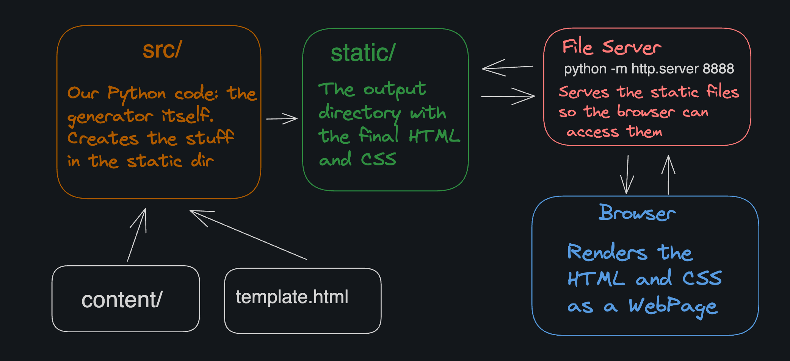

The flow of data through the full system is:

1. Markdown files are in the /content directory. A template.html file is in the root of the project.
1. The static site generator (the Python code in src/) reads the Markdown files and the template file.
1. The generator converts the Markdown files to a final HTML file for each page and writes them to the /static directory.
1. We start the built-in Python HTTP server (a separate program, unrelated to the generator) to serve the contents of the /static directory on http://localhost:8888 (our local machine).
1. We open a browser and navigate to http://localhost:8888 to view the rendered site.

